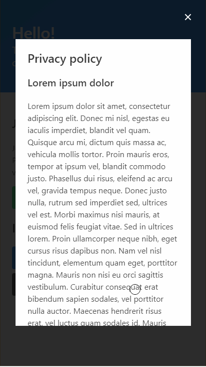

# Border Control Queueing System

Border Control Queueing System prototype I made for HackYeah 2020 Online.

The prototype covers only front-end.

## Hypothetical scenario

1. User arrives to the border control station and then is provided with application URL
1. After browsing to said URL, an unique HTTPS cookie is set in the browser creating session
1. User can then read Privacy policy and check newest info regarding the pandemic
1. Next step is to get queued. To do that, the user can:
    * scan QR code provided by border control officer or trusted volunteer
    * enter PIN code provided by border control officer or trusted volunteer
1. Both QR and PIN codes already point to correct queue, so this system can be used across multiple stations without deploying separate instances of backend software
    * QR and PIN codes are generated on demand and single-use
1. Now the user is queued. The place in queue is connected to user session
1. During the wait, the user can fill out necessary forms digitally in the app
    * The forms may be checked automatically for errors and inconsistencies to filter out people with questionable rights to cross the border
1. When position in queue is close to beginning, the user is notified
1. At the border the user presents the officers with "Security codes", which gives them access to filled out forms and confirms the position it the queue

## Demo
The demo can be found [here](https://lukask32.github.io/Border-Control-Queueing-System-Prototype/). It is not responsive and designed only for "small", smartphone screens.



## Prototype build Setup

```bash
# install dependencies
$ npm install

# serve with hot reload at localhost:3000
$ npm run dev

# build for production and launch server
$ npm run build
$ npm run start

# generate static project
$ npm run generate
```

For detailed explanation on how things work, check out [Nuxt.js docs](https://nuxtjs.org).
